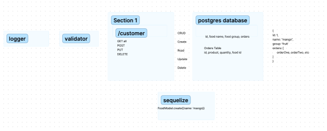

# basic-api-server

### Author: Camilla Rees
### Version: 1.0.0

### Deployment and Documentation
[Deployed Server on Render](https://bearer-auth-2.onrender.com/)

## Overview

A REST API built using Express, by creating a proper series of endpoints that perform CRUD operations on a database, using the REST standard.

## How it Works

- Created 2 SQL data models using the Sequelize libary, make sure you export those model instances.
- In the express server, created a route module for each data model. Within the router module, created REST route handlers for each of the REST Methods that properly calls the correct CRUD method from the matching data model.

## Key Features

1. Add a Record
  - CRUD Operation: Create
  - REST Method: POST
  - Path: /food
  - Input: JSON Object in the Request Body
  - Returns: The record that was added to the database.

2. Get All Records
  - CRUD Operation: Read
  - REST Method: GET
  - Path: /food
  - Returns: An array of objects, each object being one entry from your database.

3. Get One Record
  - CRUD Operation: Read
  - REST Method: GET
  - Path: /food/1
  - Returns: The object from the database, which has the id matching that which is in the path.

4. Update a Record
  - CRUD Operation: Update
  - REST Method: PUT
  - Path: /food/1
  - Input: JSON Object in the Request Body
  - Returns: The object from the database, which has the id matching that which is in the path, with the updated/changed data.

5. Delete a Record
  - CRUD Operation: Destroy
  - REST Method: DELETE
  - Path: /food/1
  - Returns: The record from the database as it exists after you delete it (i.e. null).

## Architecture

- Express
- Sequelize

## Change Log
[PR 1](https://github.com/camillarees/basic-api-server/pull/1)
[PR 2](https://github.com/camillarees/basic-api-server/pull/2)
[PR 3](https://github.com/camillarees/basic-api-server/pull/3)
[PR 4](https://github.com/camillarees/basic-api-server/pull/4)
[PR 5](https://github.com/camillarees/basic-api-server/pull/5)
[PR 6](https://github.com/camillarees/basic-api-server/pull/6)

## Credit and Collaborations
- [401n49 Demo Code](https://github.com/codefellows/seattle-code-javascript-401d49/tree/main/class-03/live-demo/pg-models)

